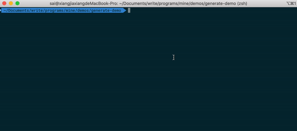

# xxx-generate-cli

用来生成一些项目的脚手架。



## 安装

### 本地安装

```
npm install xxx-generate-cli --save-dev
npm install @xxx-generate-cli/init --save-dev
```

### 全局安装

```
npm install xxx-generate-cli -g
npm install @xxx-generate-cli/init -g
```

## 使用

1. 初始化

   ```
   mkdir project-name
   cd project-name
   npm init -y
   ```


| 命令 | 参数       | 选项    | 说明                                                         | 例子                          |
| ---- | ---------- | ------- | ------------------------------------------------------------ | ----------------------------- |
| init | react/base | 无      | 初始化项目，指定react表示按照react的开发环境来生成，ba se表示一个基础的版本（不包含任何框架） | `xxx-generate-cli init react` |
| add  | storybook  | --react |                                                              |                               |

## 例子

1. 初始化base项目

   ```
   ./node_modules/.bin/xxx-generate-cli init base
   ```

2. 初始化react项目

   ```
   ./node_modules/.bin/xxx-generate-cli init react
   ```

3. 初始化react项目之后，再添加storybook

   ```
   ./node_modules/.bin/xxx-generate-cli init react
   ./node_modules/.bin/xxx-generate-cli add storybook --react
   ```

## 说明

1. 生成的项目，默认配置好了`commitlint`,`eslint`,`stylelint`,`prettier`,`typescript`,`webpack`

   1. commilint使用默认的配置**@commitlint/config-conventional**

   2. eslint使用了**esllint-plugin-xxx-eslint**，其支持的规则集有

      1. eslint:recommended
      2. plugin:node/recommended
      3. plugin:react/recommended等

   3. styelint目前规则有

      ```
      'stylelint-config-recommended',
      'stylelint-config-css-modules',
      'stylelint-prettier/recommended',
      'stylelint-no-unsupported-browser-features'
      ```

   4. webpack配置使用了create-react-app所获得的相关配置。

2. 因为使用了新版的husky，所以需要git版本\>=2.13.2.

> 目前暂只支持快速生成react项目

